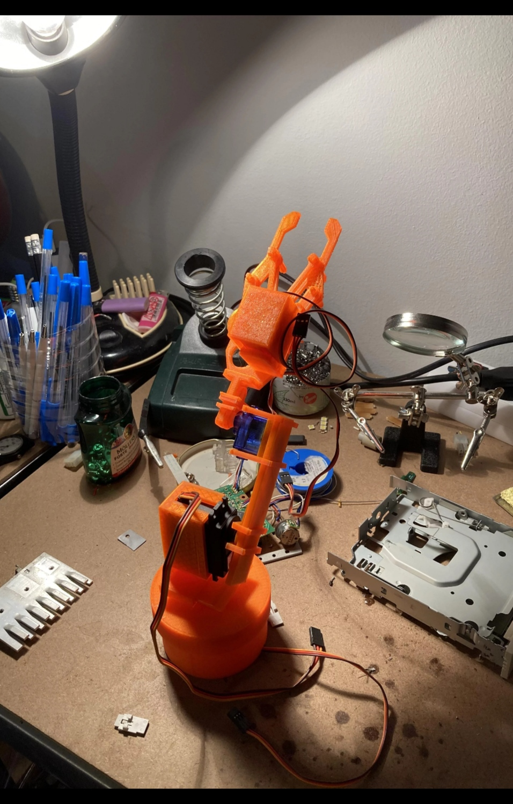

# Robot_arm_demo

 

# Summary

This is a demo of my first ever robot arm design, I designed and programmed it when I initially learned how to use CAD and write code.
It was poorly desinged and coded as I was inexperienced at the time but it can be used in order learn how to use a manipulator with an arduino.

 

# Demo

 

# Prerequisites

- Arduino UNO
- Jumper wires  
- 3D printer
- 1 standard servo motor
- 2 SG90 Servo Motors
